# AdGuard Homelab — Network Diagram

This folder contains **diagram exports** for the AdGuard project.

## Files

- `exports/adguard-homelab-2025-10-28.svg` — Vector (best for zooming & diffs)
- `exports/adguard-homelab-2025-10-28.png` — Raster preview

## Preview

## Notes
- Zones: LAN, WAN/Gateway, Internet, Tailscale overlay
- Key services:
  - AdGuard (DNS 53, DHCP 67/68, HTTP 80, SSH 22), DoH to Quad9
  - NAS (SMB 445, NFS 2049)
  - Proxmox host (8006, SSH 22)
  - nginx VM (HTTP 80, HTTPS 443)
- DHCP scope: 192.168.1.100–200; Gateway: 192.168.1.254
