# AdGuard Home — Evidence Pack (2025-10-21)

Reproducible proof that AdGuard Home is the active DNS sinkhole, DHCP is issuing leases, policies block ads, and the host is correctly firewalled.

Set a helper var for commands:

~~~bash
export ADGUARD_IP=192.168.1.10   # ← adjust if different
~~~

## Index
1. [DNS latency sanity check](#1-dns-latency-sanity-check)
2. [Positive/negative DNS tests](#2-positive--negative-dns-tests)
3. [Client nameserver verification](#3-client-nameserver-verification)
4. [Host firewall — rules added](#4-host-firewall--rules-added)
5. [AdGuard config — key settings](#5-adguard-config--key-settings)
6. [DHCP — active leases (CLI)](#6-dhcp--active-leases-cli)
7. [Listening ports](#7-listening-ports)
8. [AdGuard service state](#8-adguard-service-state)
9. [Host firewall — status](#9-host-firewall--status)
10. [Policy hit — ad domain blocked](#10-policy-hit--ad-domain-blocked)
11. [DHCP UI — scope & leases (UI)](#11-dhcp-ui--scope--leases-ui)
12. [DNS settings — upstreams & DNSSEC (UI)](#12-dns-settings--upstreams--dnssec-ui)
13. [Dashboard — 24h stats snapshot](#13-dashboard--24h-stats-snapshot)

---

## 1) DNS latency sanity check
**Proves:** Resolver responds consistently (baseline performance).  
**Replicate:**
~~~bash
for i in {1..10}; do
  dig @$ADGUARD_IP cloudflare.com +stats | awk '/Query time/{print $4 " ms"}'
done
~~~
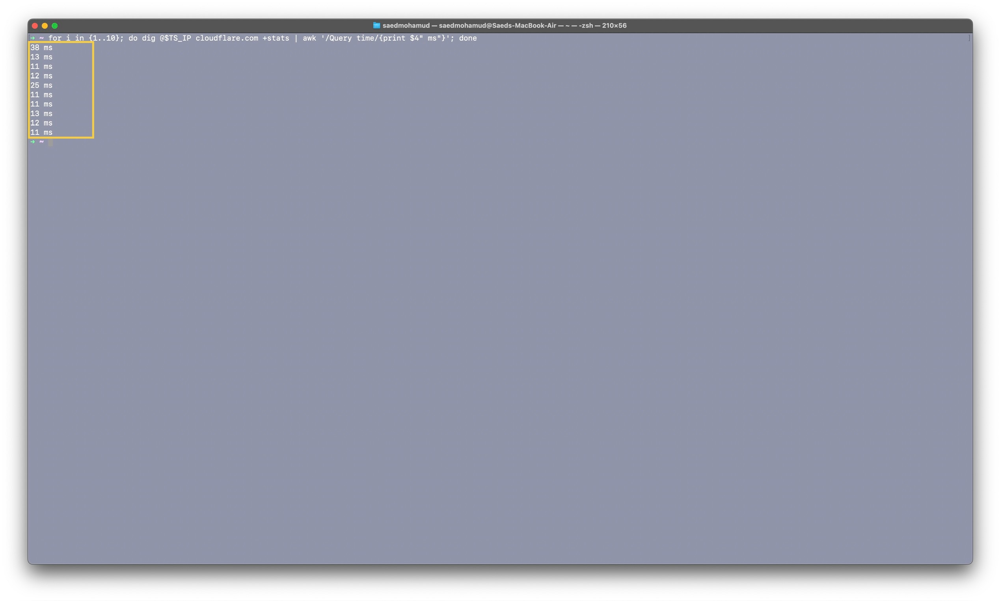

---

## 2) Positive / negative DNS tests
**Proves:** Normal domains resolve; ad domains are blocked at DNS.  
**Replicate:**
~~~bash
dig @$ADGUARD_IP example.com +stats
dig @$ADGUARD_IP doubleclick.net +stats
~~~
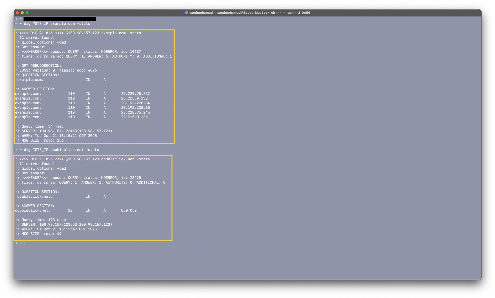

---

## 3) Client nameserver verification
**Proves:** macOS client is using AdGuard as resolver.  
**Replicate (macOS):**
~~~bash
scutil --dns | grep 'nameserver\[[0-9]\+\]' | uniq
~~~
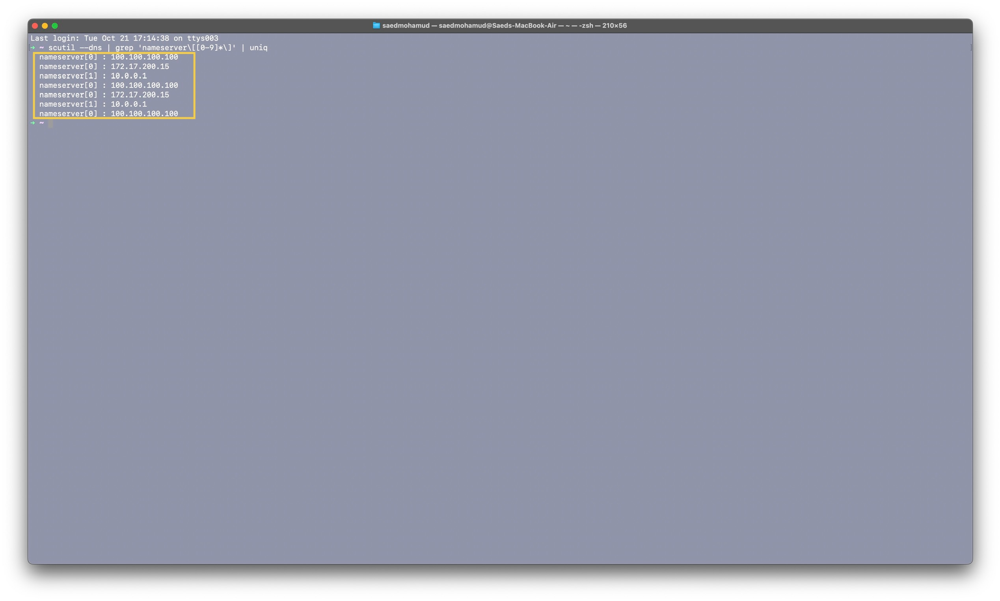

---

## 4) Host firewall — rules added
**Proves:** Only required ports opened; DHCP/DNS/HTTP/SSH allowed appropriately.  
**Replicate:**
~~~bash
sudo ufw show added
~~~
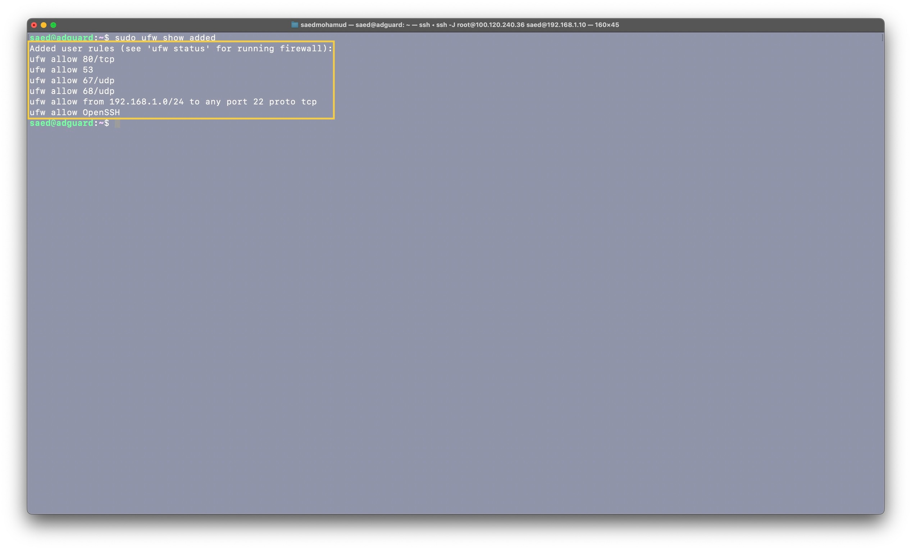

---

## 5) AdGuard config — key settings
**Proves:** Global protection enabled; DNSSEC flag state; DHCP v4 configured.  
**Replicate:**
~~~bash
sudo grep -En 'protection_enabled|enable_dnssec|^dhcp:|^[[:space:]]*v4' /opt/AdGuardHome/AdGuardHome.yaml
~~~
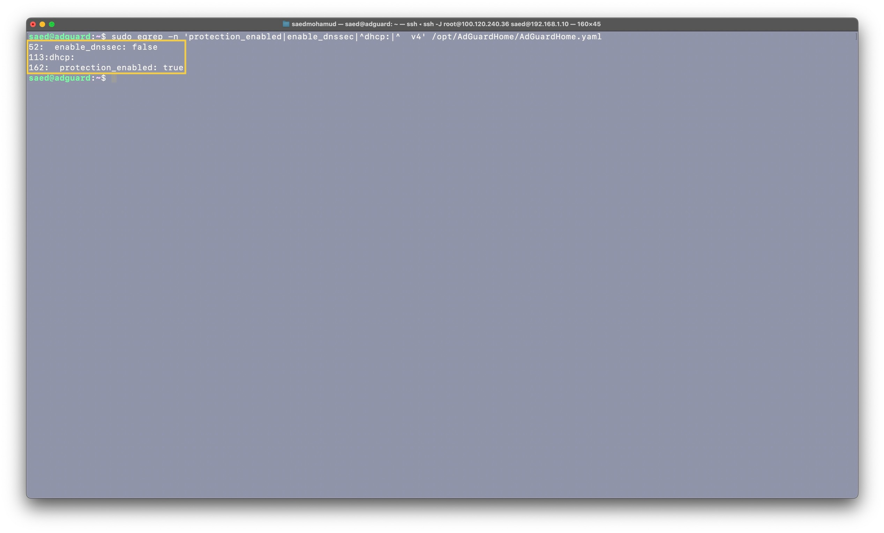

---

## 6) DHCP — active leases (CLI)
**Proves:** AdGuard is issuing leases to LAN clients.  
**Replicate:**
~~~bash
sudo head -n 20 /opt/AdGuardHome/data/leases.json
~~~
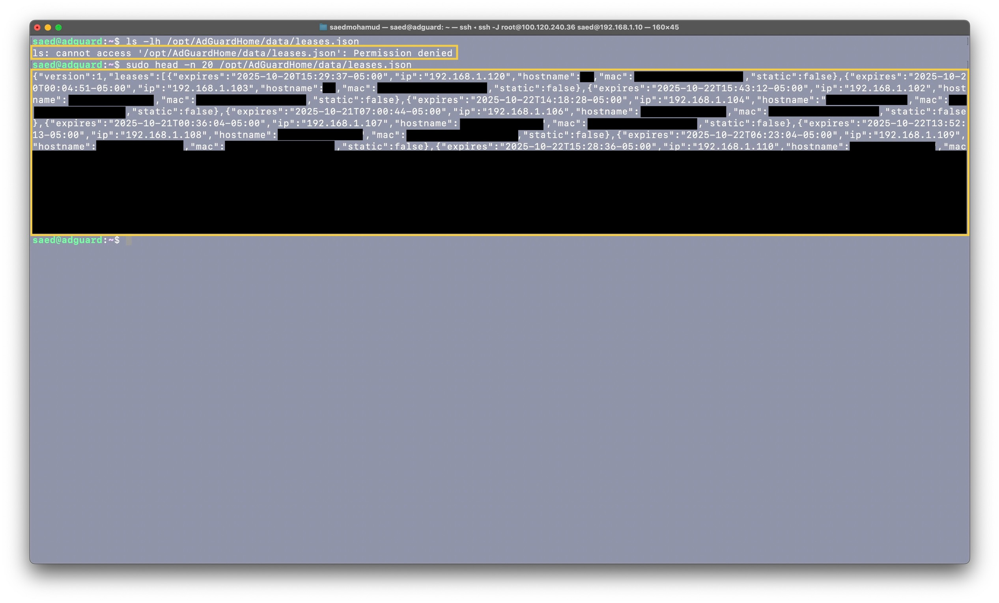

---

## 7) Listening ports
**Proves:** Expected services listening (53/67/68/80/22), nothing extra.  
**Replicate:**
~~~bash
ss -lntup | egrep '(:53|:67|:68|:80|:443|:3000|:22)'
~~~
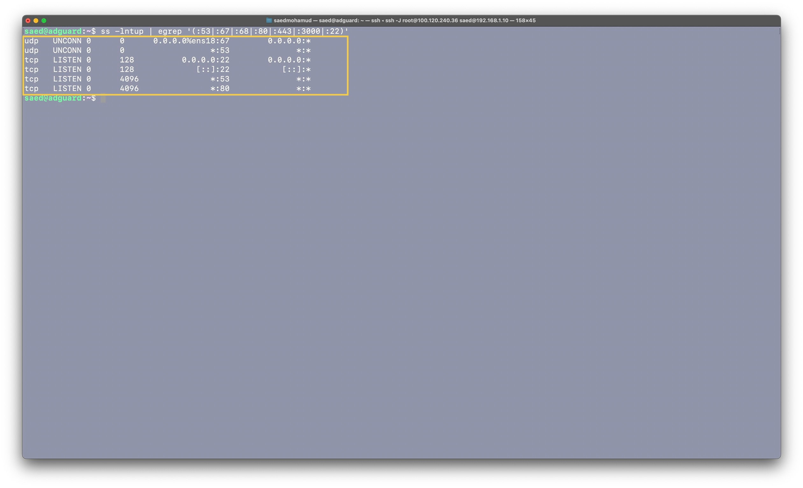

---

## 8) AdGuard service state
**Proves:** Service is enabled and active.  
**Replicate:**
~~~bash
systemctl is-active --quiet AdGuardHome && echo "ACTIVE" || echo "INACTIVE"
systemctl status --no-pager AdGuardHome
~~~
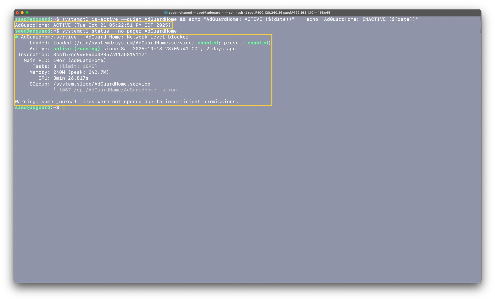

---

## 9) Host firewall — status
**Proves:** UFW is active; rule set matches intended policy.  
**Replicate:**
~~~bash
sudo ufw status verbose
sudo ufw status numbered
~~~
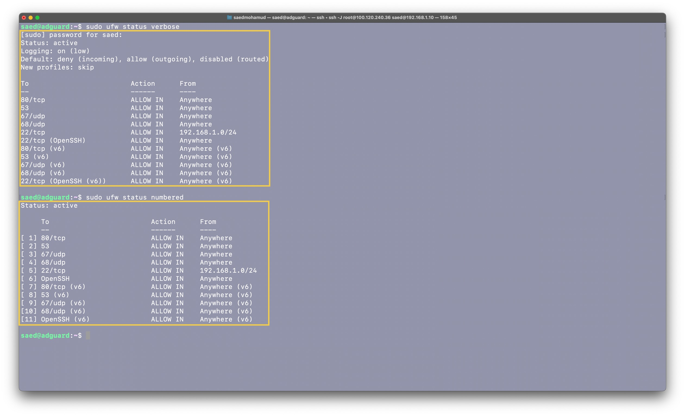

---

## 10) Policy hit — ad domain blocked
**Proves:** Real client traffic to ad domains is blocked by filter lists.  
**Replicate:** AdGuard UI → **Query Log** → search `doubleclick.net`  
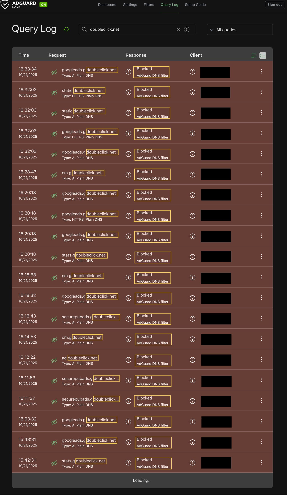

---

## 11) DHCP UI — scope & leases (UI)
**Proves:** DHCP scope/gateway configured; live leases visible.  
**Replicate:** UI → **Settings → DHCP settings**.  
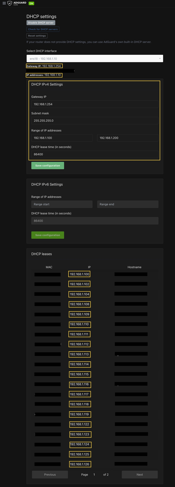

---

## 12) DNS settings — upstreams & DNSSEC (UI)
**Proves:** Upstream DoH (e.g., Quad9), fallback DNS, DNSSEC/EDNS flags state.  
**Replicate:** UI → **Settings → DNS settings**.  
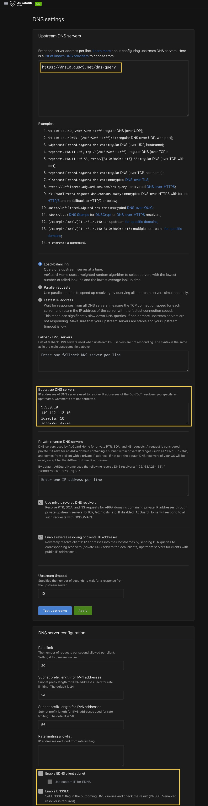

---

## 13) Dashboard — 24h stats snapshot
**Proves:** System is actively filtering at scale; shows % blocked, clients, avg processing time.  
**Replicate:** UI → **Dashboard**.  
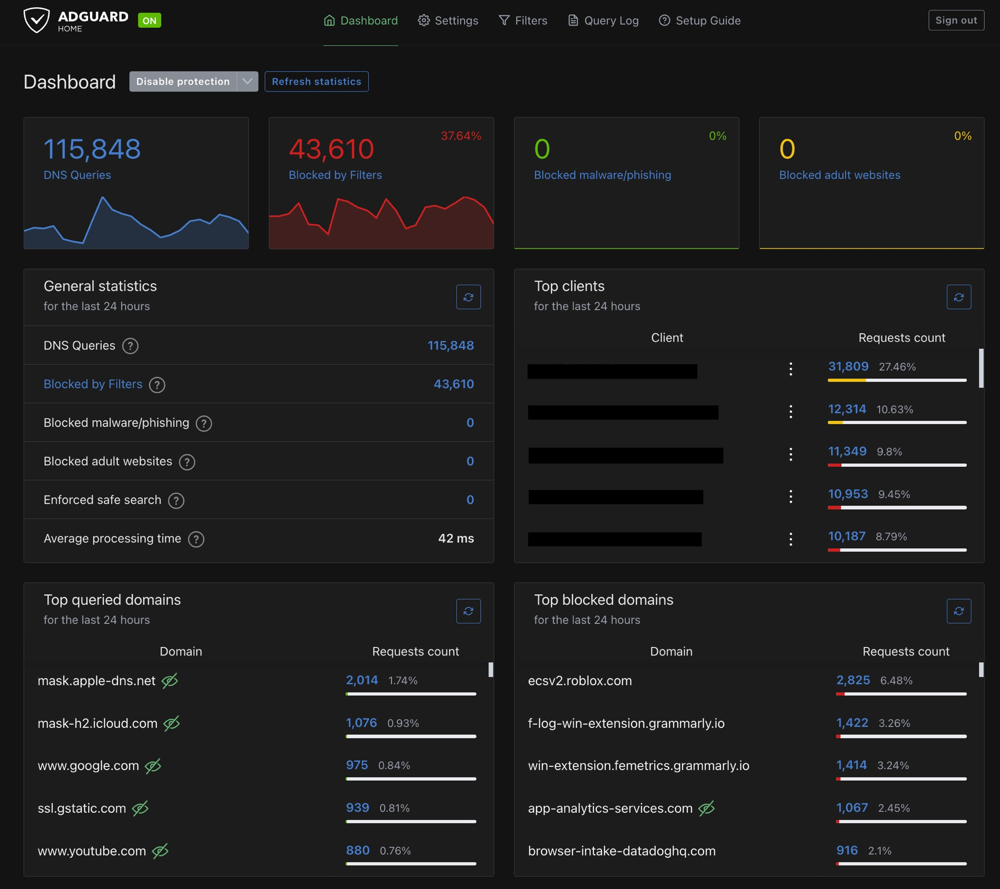
