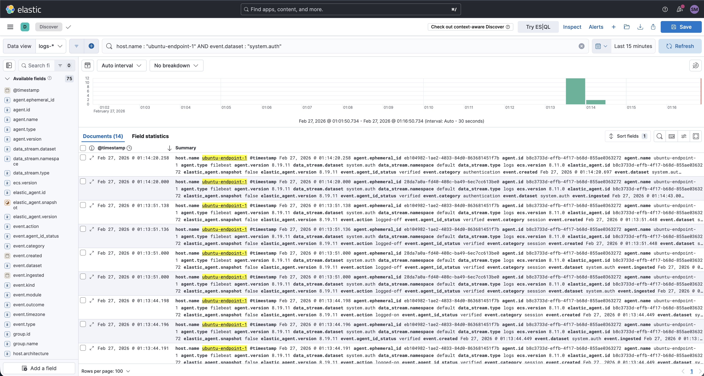

# AI-Assisted SOC Lab

A portfolio project demonstrating how a Security Operations Center workflow can be built in a controlled lab environment using **Elastic SIEM**, **custom Python automation**, and an **AI-assisted triage and reporting layer**. The lab ingests endpoint telemetry, generates detections, enriches alerts with readable analyst context, and exposes executive-style reporting through WhatsApp.

---

## 1️⃣ Situation

Security Operations Centers depend on visibility, repeatable detections, and disciplined analyst workflows. In many environments, however, alert review is still slowed down by repetitive triage steps, fragmented tooling, and reporting that is not easily consumable outside the analyst console.

I built this project to simulate a structured SOC workflow in a self-hosted lab where endpoint activity is collected, detections are engineered and validated, and a custom AI-assisted layer helps translate raw alert data into readable investigation support and operator-facing summaries.

The project runs inside my Proxmox-based lab and is documented phase by phase to show not only the final outcome, but the engineering process used to reach it.

---

## 2️⃣ Task

Design and implement a lab-based SOC workflow that demonstrates:

- centralized endpoint log ingestion into Elastic
- visibility into security-relevant Linux telemetry
- custom detection engineering for meaningful endpoint activity
- AI-assisted alert triage and investigation support
- command-driven executive reporting through WhatsApp
- evidence-backed documentation suitable for portfolio review

The goal was not to build “AI for the sake of AI,” but to show how AI can be placed behind a disciplined SOC workflow as a recommendation and reporting layer while Elastic remains the source of truth for detections and alerts.

---

## 3️⃣ Architecture

### Environment Components

- **Proxmox VE Host**
- **VM 200 – SOC Management Node**  
  Hosts the Python automation, Flask webhook, AI-assisted triage logic, and reporting workflows
- **VM 201 – Elastic Node**  
  Hosts the Elastic stack used for log ingestion, search, detection rules, and alerting
- **VM 202 – Ubuntu Endpoint**  
  Primary endpoint generating system and authentication telemetry
- **Elastic Stack (Fleet, Elasticsearch, Kibana)**
- **Custom Python SOC assistant layer**
- **Twilio WhatsApp integration**
- **ngrok HTTPS tunnel for webhook testing**

### Alert and Reporting Flow

    Endpoint activity
        ↓
    Elastic Agent
        ↓
    Elasticsearch logs
        ↓
    Detection rules trigger alerts
        ↓
    elastic_poller.py queries alerts
        ↓
    Alert checked against SQLite memory
        ↓
    If new → send to AI analysis
        ↓
    AI generates SOC explanation
        ↓
    Flask API formats response
        ↓
    Twilio sends WhatsApp message
        ↓
    User receives SOC output

### Architecture Responsibilities

- **Visibility and detection** → Elastic SIEM
- **Alert polling and deduplication** → `elastic_poller.py` + SQLite
- **Readable alert analysis** → OpenAI-assisted triage logic
- **Operator interaction** → Flask webhook + Twilio WhatsApp
- **Executive-style reporting** → command-based summary and alert response workflow

### Engineering Boundaries

This is a **lab implementation**, not a production SOC platform. The AI layer is recommendation-only and does not:
- close alerts
- modify rule severity
- replace analyst judgment
- replace formal case management

Elastic remains the detection source of truth, and the human analyst remains the final decision-maker.

---

## 4️⃣ Phases Implemented

This project was built in four phases to reflect a realistic security engineering progression: first establish infrastructure and visibility, then build detections, then add triage support, then add operator-facing reporting.

### Phase 1 — Infrastructure

Established the core lab environment and verified that the Ubuntu endpoint was enrolled, healthy, and sending security-relevant logs into Elastic.

**Key evidence**

**Detailed phase write-up**  
See: `./phases/phase-01-infrastructure.md`

---

### Phase 2 — Detection Engineering

Created and validated custom Linux detection rules for suspicious user creation, sudo group modification, privilege escalation behavior, SSH brute force activity, and brute force followed by successful login.

**Detailed phase write-up**  
See: `./phases/phase-02-detection-engineering.md`

---

### Phase 3 — AI Triage Layer Integration

Integrated a custom Python-based AI triage layer that polls Elastic alerts, suppresses duplicates with SQLite, generates readable analyst notes, and supports investigation-oriented output.

**Key evidence**

**Detailed phase write-up**  
See: `./phases/phase-03-ai-triage-layer-integration.md`

---

### Phase 4 — Executive Reporting Automation

Extended the triage layer into a mobile-friendly operator reporting workflow using Flask, ngrok, Twilio WhatsApp, and command-driven outputs such as `check alerts`, `last alert`, `investigate`, and `soc summary`.

**Key evidence**

**Detailed phase write-up**  
See: `./phases/phase-04-executive-reporting-automation.md`

---

## 5️⃣ Skills Demonstrated

- Elastic SIEM deployment and telemetry validation
- Endpoint log ingestion and data visibility verification
- Linux-focused detection engineering
- Alert validation and evidence-backed testing
- Python automation for SOC workflows
- SQLite-based deduplication and state tracking
- Flask webhook development
- Twilio WhatsApp integration
- AI-assisted alert enrichment and readable reporting
- Structured technical documentation for portfolio presentation

---

## 6️⃣ Long-Term Vision

This lab is intended to grow from a strong analyst-assist workflow into a broader security operations showcase. Future improvements may include:

- stronger case-management integration
- richer multi-step investigation workflows
- more formalized analyst review checkpoints
- scheduled reporting with clearer severity rollups
- additional endpoints and broader detection coverage
- production-style hardening of the reporting and webhook layer

The long-term goal is to demonstrate not just tool familiarity, but disciplined SOC engineering: visibility first, detections second, controlled automation third, and clear documentation throughout.

