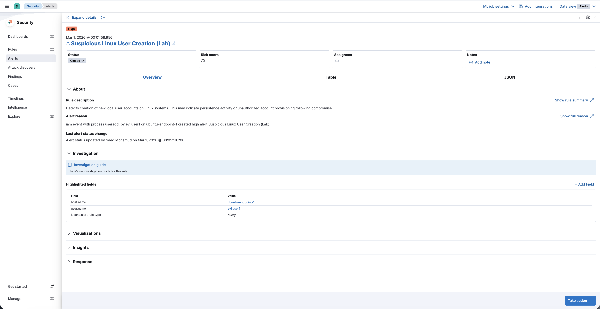
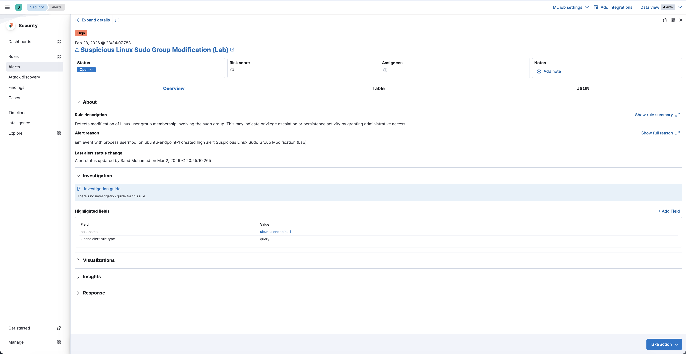
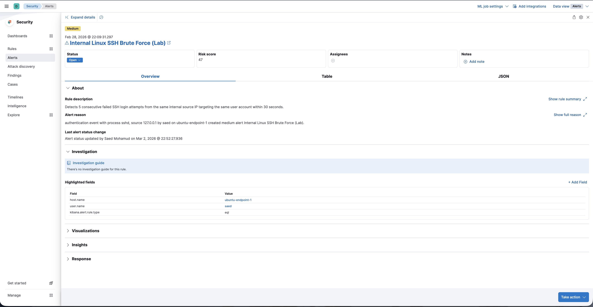
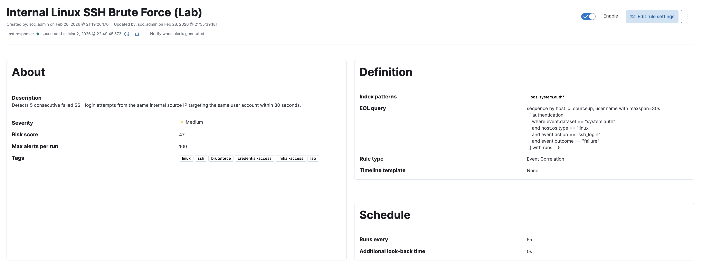

# Phase 02 – Detection Engineering

## 1. Phase Objective

Build and validate the first meaningful detection layer on top of the infrastructure established in Phase 01.

This phase focused on converting raw Linux endpoint telemetry into actionable security alerts inside Elastic Security. The goal was to move from basic visibility into deliberate detection engineering by creating custom rules, simulating relevant activity, validating alert output, and refining rule logic where necessary.

No AI-assisted triage or reporting logic was introduced in this phase. The purpose here was narrower and foundational: prove that the lab could detect suspicious Linux activity in a controlled, evidence-backed way before any automation was added on top.

---

## 2. Environment Overview at the Time of the Phase

At the time of this phase, the environment consisted of:

- **VM 200 – soc-mgmt**  
  Management node used to administer the project and document validation steps

- **VM 201 – elastic-node**  
  Elastic Security environment where custom detection rules were created, executed, and reviewed

- **VM 202 – ubuntu-endpoint-1**  
  Monitored Linux endpoint generating the events used for rule testing and alert validation

### Detection stack in use

- **Elastic Security** for rule creation and alerting
- **Kibana** for rule configuration review and alert validation
- **Discover** for raw event inspection
- **`logs-system.auth*`** as the primary index pattern used for detection rules
- **KQL** for event-query rules
- **EQL** for correlation-based SSH rules

This phase depended directly on the outcome of Phase 01. The endpoint had already been enrolled, logs were visible, and the `system.auth` dataset had been confirmed as a reliable telemetry source for Linux-focused detections.

---

## 3. Design Philosophy

This phase followed an evidence-first detection engineering approach.

The rules were not added just to increase the rule count. Each one had to satisfy a more useful standard:

- it had to map to activity that could reasonably matter in a SOC context
- it had to be grounded in telemetry actually present in the lab
- it had to be testable using controlled endpoint actions
- it had to produce a reviewable alert in Elastic Security
- it had to remain understandable enough to explain and defend

The phase also intentionally included a mix of rule types:

- **single-event query rules** for direct high-signal activity such as user creation or sudo group changes
- **event correlation rules** for SSH attack patterns that cannot be reliably modeled as one isolated event

That distinction is important. A strong detection phase is not just about writing queries. It is about choosing the correct detection method for the behavior being modeled.

---

## 4. Definition of What Makes the Phase Done

Phase 02 is considered complete only when all of the following are true:

- the Elastic detection engine is operational
- each planned custom rule has been created successfully
- each rule shows successful execution
- controlled test activity causes the expected alert to fire
- the resulting alerts contain the expected host and event context
- the detection logic reflects the actual endpoint telemetry observed in Discover
- the endpoint is returned to a clean state after testing where appropriate

This standard matters because later AI triage is only useful if the underlying alerts are worth triaging in the first place.

---

## 5. Validation Commands or Tests

The following controlled activities were used to validate the rules built in this phase.

### Rule 01 — Suspicious Linux User Creation (Lab)

**Purpose**  
Detect creation of new local user accounts on the Linux endpoint, which may indicate persistence or unauthorized account provisioning after compromise.

**Rule type**  
Query rule

**Detection logic**  
Monitors the `system.auth` dataset for process-based user creation activity using `useradd`.

**Validation activity**  
Created a test user on the Ubuntu endpoint to trigger account creation telemetry.

**What was confirmed**
- the raw event was visible in the source telemetry
- the rule executed successfully
- Elastic Security generated the expected alert
- the alert correctly tied the activity to `ubuntu-endpoint-1`

### Rule 02 — Suspicious Linux Sudo Group Modification (Lab)

**Purpose**  
Detect modification of Linux group membership involving the `sudo` group, which may indicate privilege escalation or persistence through administrative access assignment.

**Rule type**  
Query rule

**Detection logic**  
Looks for `usermod` activity involving the `sudo` group within the `system.auth` dataset.

**Validation activity**  
Used a controlled group membership change to add a user into the `sudo` group.

**Validation command**

    sudo usermod -aG sudo eviluser1

**What was confirmed**
- the group modification event was present in the telemetry
- the rule executed successfully
- the corresponding alert was generated in Elastic Security
- the alert represented a meaningful privilege-related change rather than generic system noise

### Rule 03 — Suspicious Linux Sudo Privilege Escalation (Lab)

**Purpose**  
Detect successful sudo execution by a non-root user, which may indicate post-compromise privilege escalation or unauthorized administrative activity.

**Rule type**  
Query rule

**Detection logic**  
Monitors successful sudo session activity in `system.auth` and excludes known expected administrative noise where appropriate.

**Validation activity**  
Performed controlled sudo execution from the monitored endpoint.

**What was confirmed**
- sudo activity was present in the underlying logs
- the rule executed successfully
- a high-severity alert was generated
- the alert showed the correct host and user context for review

### Rule 04 — Internal Linux SSH Brute Force (Lab)

**Purpose**  
Detect repeated failed SSH login attempts from the same internal source IP against the same user within a short time window.

**Rule type**  
Event correlation rule

**Detection logic**  
Uses EQL sequence logic to identify five consecutive failed `ssh_login` authentication events within a defined maximum timespan.

**Why correlation was used**  
A brute-force pattern is not one event. It is a repeated sequence of related failed attempts. Modeling that behavior as a correlation rule is more appropriate than trying to detect it with a single-event query.

**Validation activity**  
Generated repeated failed SSH login attempts in a controlled test sequence.

**What was confirmed**
- the failed authentication events were present in the telemetry
- the EQL sequence rule executed successfully
- the brute-force pattern produced the expected medium-severity alert

### Rule 05 — Linux SSH Brute Force Followed by Successful Login (Lab)

**Purpose**  
Detect a higher-risk sequence in which repeated failed SSH logins are followed by a successful login from the same source IP and user, indicating possible credential compromise.

**Rule type**  
Event correlation rule

**Detection logic**  
Uses EQL to identify five failed `ssh_login` events followed by a successful `ssh_login` event from the same source and user within the configured time window.

**Why this rule matters**  
This rule is stronger than simple failed-login monitoring because it attempts to detect a pattern that looks more like successful attacker progression: repeated failures, then access gained.

**Validation activity**  
Performed repeated failed SSH attempts followed by a successful login in the lab.

**What was confirmed**
- the full sequence existed in the raw event data
- the rule executed successfully
- Elastic Security generated the expected high-severity alert
- the alert captured a multi-event attack story rather than one isolated log entry

---

## 6. Evidence Collection / Screenshots

### 6.1 Rule 01 — User creation

**Alert evidence**

**Configuration evidence**

### 6.2 Rule 02 — Sudo group modification

**Alert evidence**

**Configuration evidence**

### 6.3 Rule 03 — Sudo privilege escalation

**Alert evidence**

**Configuration evidence**

### 6.4 Rule 04 — SSH brute force

**Alert evidence**

**Configuration evidence**

### 6.5 Rule 05 — SSH brute force followed by successful login

**Alert evidence**

**Configuration evidence**

### What the evidence set proves overall

Taken together, the Phase 02 evidence proves that:

- custom Linux detection rules were successfully implemented in Elastic Security
- both query-based and correlation-based detections were validated
- controlled endpoint activity produced the intended alert behavior
- rule definitions and resulting alerts were both documented
- the project had moved from simple telemetry visibility into true detection capability

---

## 7. Engineering Discipline Note

This phase was important because it forced the project to earn the right to proceed.

It is easy to claim a SOC lab exists once logs are visible. It is harder, and more meaningful, to show that detections were deliberately engineered, tested, and validated against the actual telemetry available in the environment.

That is the discipline Phase 02 established:

- detections were based on observed data, not vague assumptions
- rule logic matched the available Linux telemetry
- multi-event attack patterns were modeled with correlation where appropriate
- each detection had evidence for both its definition and its output

By the end of this phase, the lab no longer had only visibility. It had a working, evidence-backed detection layer that could support analyst review and later AI-assisted triage.

