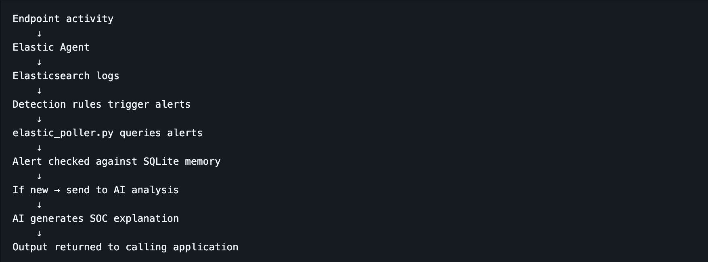
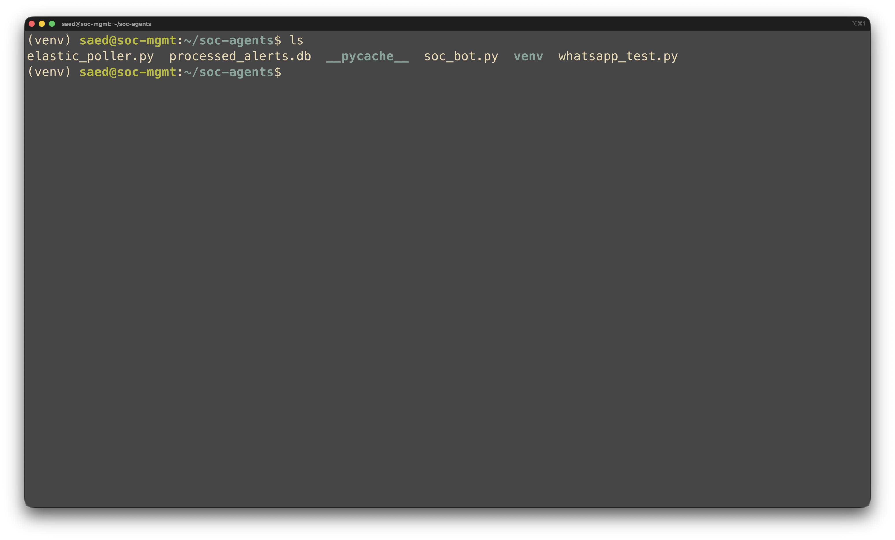
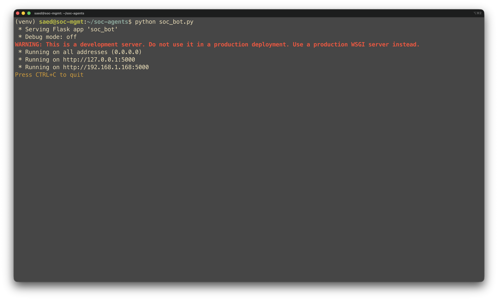
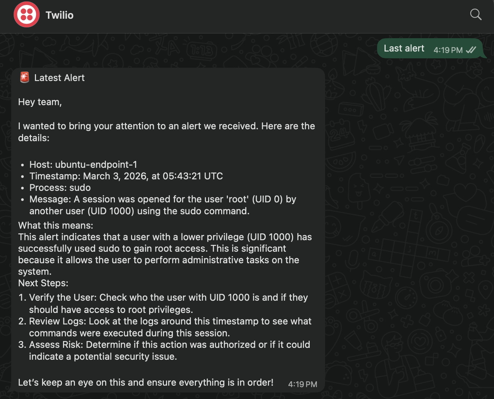
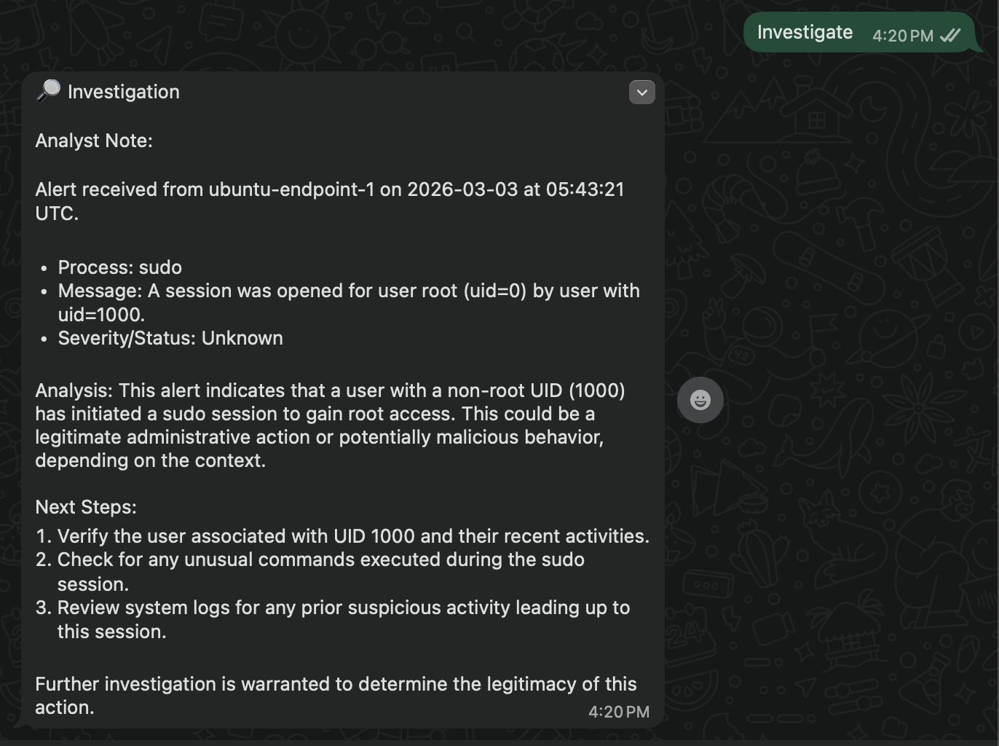

# Phase 03 – AI Triage Layer Integration

## 1. Phase Objective

Integrate a controlled AI-assisted triage layer on top of the validated Elastic detection environment built in Phases 01 and 02.

The purpose of this phase was to take already validated Elastic alerts and make them more readable and usable for first-pass analyst review. Instead of replacing Elastic or pretending the AI model was making security decisions, this phase focused on a narrower and more realistic problem: turning raw alert output into concise analyst-oriented explanations, investigation notes, and triage-friendly summaries.

This phase established the first version of the custom SOC assistant layer. It introduced alert polling, duplicate suppression through SQLite, OpenAI-assisted explanation generation, and reusable triage functions that could later be exposed through a reporting interface.

---

## 2. Environment Overview at the Time of the Phase

At the time of this phase, the lab environment consisted of:

- **VM 200 – soc-mgmt**  
  Hosted the Python triage code, local SQLite state tracking, and application logic used to query Elastic and generate readable outputs

- **VM 201 – elastic-node**  
  Hosted Elasticsearch, Kibana, and the validated detection rules from Phase 02

- **VM 202 – ubuntu-endpoint-1**  
  Generated the underlying endpoint activity that led to the alerts being triaged

### Core components used in this phase

- **Python 3**
- **OpenAI API**
- **Model:** `gpt-4o-mini`
- **Elasticsearch HTTPS queries**
- **SQLite**
- **Custom Python scripts**
  - `elastic_poller.py`
  - `soc_bot.py`

### Data sources queried

- **Alert index:** `.alerts-security.alerts-default`
- **Log index pattern:** `logs-*`

This phase depended entirely on the work from the earlier phases. The environment already had a functioning Elastic pipeline and a validated set of Linux detections. The triage layer therefore operated on top of real alert data instead of mocked examples.

---

## 3. Design Philosophy

This phase followed a controlled-assistance model.

The AI was not treated as a detection engine, case manager, or decision-maker. Elastic remained the source of truth for alert generation, while the AI layer was introduced strictly to improve readability and triage usability.

The design principles were:

- **ground the model in real alert data**
- **separate detection from explanation**
- **preserve human review as the final authority**
- **avoid duplicate operator noise**
- **keep outputs concise and operationally useful**

That meant the triage layer had one job: help interpret and package validated alert data in a way that better supports analyst review.

---

## 4. Definition of What Makes the Phase Done

Phase 03 is considered complete only when all of the following are true:

- the SOC management node can query Elastic alerts successfully
- recent endpoint event context can be retrieved from `logs-*`
- OpenAI-assisted explanations are generated from real alert data
- duplicate alert reporting is suppressed through SQLite tracking
- the triage functions return readable and repeatable outputs
- the implementation is evidenced through script execution, project files, and generated analyst-style responses

This standard matters because AI integration is only useful if it is connected to working detections, produces grounded outputs, and behaves predictably.

---

## 5. Validation Commands or Tests

The following checks were used to validate the triage layer introduced in this phase.

### Test 1 — Confirm triage project files exist on the SOC management node

Reviewed the SOC management node project directory to verify that the working triage components were present.

**Relevant files**
- `elastic_poller.py`
- `soc_bot.py`
- `processed_alerts.db`
- virtual environment and supporting files

**What this validated**
- the triage layer existed as a real implementation on the management node
- the project had moved beyond planning into executable code

### Test 2 — Confirm the bot application can run successfully

Executed the bot application on the SOC management node and confirmed the Flask service started successfully.

**What this validated**
- the application layer could start without immediate runtime failure
- the triage logic was available to a calling interface
- the management node was ready to serve the next integration step

### Test 3 — Confirm WhatsApp POST requests reach the application

Verified successful `POST /whatsapp` requests returning `200 OK`.

**What this validated**
- the application path from webhook request to bot handler was functioning
- the triage functions could be invoked through an external command path
- the bot was actually responding rather than just running idle

### Test 4 — Confirm latest alert explanation workflow

Used the `last alert` workflow to retrieve the most recent Elastic alert and generate a readable explanation.

**What this validated**
- alert retrieval from Elastic was functioning
- key alert fields were being extracted correctly
- the AI model returned a concise, analyst-friendly explanation grounded in real alert context

### Test 5 — Confirm investigation workflow

Used the `investigate` workflow to generate a short analyst-style note for the latest alert.

**What this validated**
- the triage layer could move beyond a simple summary into investigation support
- the AI output could provide next-step guidance without claiming final judgment
- the implementation supported recommendation-only analyst assistance

### Test 6 — Confirm high-level triage pipeline logic

Validated the intended flow from endpoint activity to Elastic alert to poller logic, SQLite memory check, AI explanation generation, and returned output.

**What this validated**
- the triage layer architecture was defined clearly
- duplicate suppression and AI explanation were part of the intended workflow
- the phase had a coherent operating design rather than isolated script behavior

---

## 6. Evidence Collection / Screenshots

### 6.1 Triage flow design

**What this proves**
- the triage pipeline was designed as a structured workflow
- alert polling, SQLite checking, AI analysis, and returned output were all accounted for in the architecture

### 6.2 Project files on SOC management node

**What this proves**
- the triage layer existed as actual implementation files on the management node
- the poller, bot logic, and SQLite database were present in the project workspace

### 6.3 Bot application running

**What this proves**
- the application started successfully
- the triage layer was operational and reachable through the Flask service

### 6.4 Successful WhatsApp POST requests

**What this proves**
- inbound requests were reaching the bot successfully
- the application path invoking the triage layer was functioning end to end

### 6.5 Latest alert response

**What this proves**
- the bot could retrieve the latest alert from Elastic
- the AI layer could turn alert fields into a readable summary for analyst review

### 6.6 Investigation response

**What this proves**
- the triage layer could produce a short analyst-style investigation note
- the output remained recommendation-oriented rather than autonomous

---

## 7. Engineering Discipline Note

This phase was important because it set boundaries around what the AI layer was allowed to do.

It would have been easy to overstate the implementation as an “AI SOC analyst,” but that would have been inaccurate. What was actually built here was more disciplined and more credible: a custom triage support layer that reads validated Elastic detections, suppresses duplicates, and produces readable analyst-oriented output.

That boundary is what makes the phase strong:

- Elastic still owns alert generation
- the AI layer assists interpretation only
- duplicate suppression improves usability
- human review remains mandatory

By the end of this phase, the project had moved beyond detection alone and into analyst-assist workflow improvement, while still keeping the system honest about what was automated and what was not.

