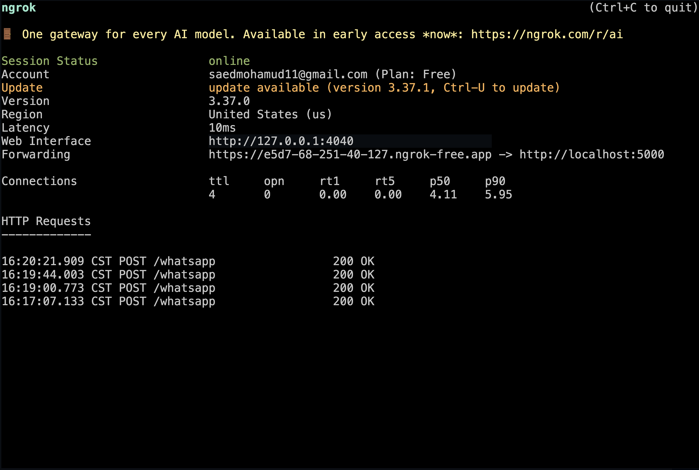
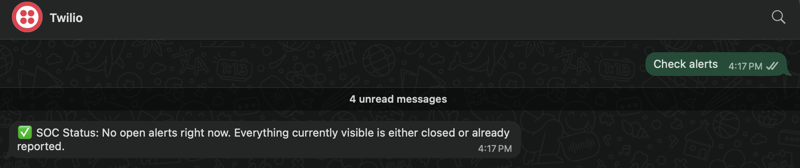
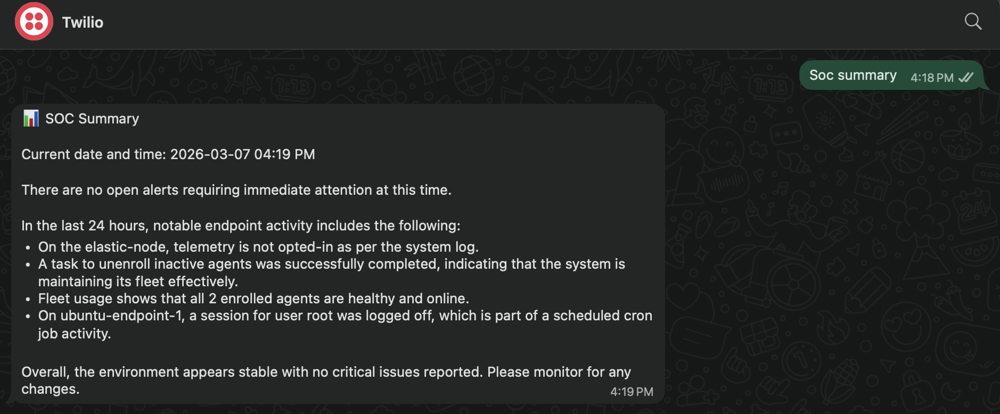

# Phase 04 – Executive Reporting Automation

## 1. Phase Objective

Extend the validated AI-assisted triage layer into a usable operator-facing reporting workflow that can be accessed from a mobile device.

The purpose of this phase was to expose the SOC assistant through a simple command-driven interface using Flask, Twilio WhatsApp, and ngrok. Rather than requiring the operator to sit inside Kibana or run local scripts manually, this phase made it possible to request alert status, recent alert context, investigation-oriented output, and a short SOC summary directly through WhatsApp.

This phase did not introduce autonomous case handling or final analyst decision-making. Its purpose was narrower and more practical: provide a clean delivery layer for the triage functions built in Phase 03.

---

## 2. Environment Overview at the Time of the Phase

At the time of this phase, the lab environment consisted of:

- **VM 200 – soc-mgmt**  
  Hosted the Flask application, command routing logic, and the existing AI-assisted triage functions

- **VM 201 – elastic-node**  
  Continued to serve as the source of alerts, detections, and endpoint log context

- **VM 202 – ubuntu-endpoint-1**  
  Continued to generate the endpoint activity that could appear in alert and summary outputs

### Core components used in this phase

- **Flask**
- **Twilio WhatsApp integration**
- **ngrok HTTPS tunnel**
- **Custom Python bot logic in `soc_bot.py`**
- **Triage and retrieval functions from `elastic_poller.py`**

### Supported commands

- `check alerts`
- `soc summary`
- `last alert`
- `investigate`

### Webhook route

- `/whatsapp`

This phase built directly on the prior phase. The triage functions already existed. The work here was to expose them through a mobile-friendly interaction path and validate that the end-to-end delivery chain functioned correctly.

---

## 3. Design Philosophy

This phase followed a delivery-layer philosophy: keep the operator interaction simple, keep the data source grounded, and keep the automation honest.

The design principles were:

- **make validated SOC outputs easier to access**
- **keep the command set small and predictable**
- **format responses for mobile readability**
- **separate the messaging layer from the detection layer**
- **avoid overstating the implementation as autonomous security operations**

That means the messaging workflow should be understood as a controlled presentation layer:

- Elastic remains the detection and alert source
- the triage logic remains in the Python assistant layer
- Flask handles inbound command processing
- Twilio and WhatsApp provide operator delivery
- ngrok is used for lab-friendly HTTPS webhook exposure

This was intentionally designed as a lab integration, not a production messaging service.

---

## 4. Definition of What Makes the Phase Done

Phase 04 is considered complete only when all of the following are true:

- the Flask bot application starts successfully on the SOC management node
- ngrok exposes the local webhook over HTTPS
- inbound WhatsApp commands reach the Flask route successfully
- command routing maps each supported command to the correct backend function
- responses are returned successfully to WhatsApp
- outputs are readable on a mobile device
- the full path from phone request to SOC response is demonstrated with evidence

This standard matters because a reporting layer is only valuable if it reliably exposes real SOC data and remains usable under the conditions it was designed for.

---

## 5. Validation Commands or Tests

The following checks were used to validate the executive reporting workflow introduced in this phase.

### Test 1 — Confirm the Flask application runs

Started `soc_bot.py` on the SOC management node and confirmed the application bound successfully to port `5000`.

**What this validated**
- the reporting interface could start successfully
- the bot was ready to receive webhook traffic
- the application layer was available for end-to-end testing

### Test 2 — Confirm ngrok forwarding is active

Started ngrok and verified that it exposed the local Flask service through a public HTTPS forwarding URL.

**What this validated**
- the local lab service could be reached by Twilio over HTTPS
- the webhook path could be tested without deploying public infrastructure
- the lab had a working inbound tunnel for WhatsApp command handling

### Test 3 — Confirm `check alerts` command works

Sent the `check alerts` command through WhatsApp and verified that the bot returned the current open-alert state.

**What this validated**
- inbound message delivery worked
- command routing worked
- the bot could respond with current SOC alert status in a readable format

### Test 4 — Confirm `last alert` command works

Sent the `last alert` command and verified that the most recent Elastic alert could be returned in a readable, mobile-friendly summary.

**What this validated**
- alert retrieval remained functional through the messaging layer
- the operator could access a quick alert briefing from the phone interface

### Test 5 — Confirm `investigate` command works

Sent the `investigate` command and verified that the bot returned a short analyst-oriented investigation note.

**What this validated**
- the investigation support workflow from Phase 03 was exposed successfully through WhatsApp
- the response remained recommendation-oriented and readable on mobile

### Test 6 — Confirm `soc summary` command works

Sent the `soc summary` command and verified that a recent SOC briefing could be returned using recent alert and endpoint context.

**What this validated**
- the summary workflow was available through the reporting interface
- the operator could request a concise management-style view of the environment from mobile

---

## 6. Evidence Collection / Screenshots

### 6.1 Flask bot running

**What this proves**
- the Flask application started successfully on the SOC management node
- the reporting service was actively listening on port `5000`

### 6.2 ngrok forwarding active

**What this proves**
- a public HTTPS forwarding path existed for webhook delivery
- inbound traffic could be forwarded from Twilio to the local Flask service

### 6.3 WhatsApp `check alerts` response

**What this proves**
- the `check alerts` command was received and processed successfully
- current alert state could be delivered in a simple mobile-friendly format

### 6.4 WhatsApp `investigate` response

**What this proves**
- the investigation-oriented triage function was exposed successfully through the messaging layer
- the operator could request a quick analyst-style note from the phone interface

### 6.5 WhatsApp `last alert` response

**What this proves**
- the most recent alert could be retrieved and summarized through the reporting workflow
- alert context remained readable outside the Kibana interface

### 6.6 WhatsApp `soc summary` response

**What this proves**
- recent environment context could be packaged into a concise executive-style briefing
- the reporting layer was capable of delivering more than just single-alert output

### What the evidence set proves overall

Taken together, the Phase 04 evidence proves that:

- the Flask, ngrok, Twilio, and triage components were integrated successfully
- command-driven SOC interaction was functioning end to end
- validated alert and summary outputs could be delivered to a mobile device
- the project had progressed from analyst-assist logic into operator-facing reporting automation

---

## 7. Engineering Discipline Note

This phase mattered because it turned the triage layer into something usable without pretending it was something more than it was.

It would have been easy to describe this as a fully automated SOC interface, but that would not be accurate. What was actually built was a disciplined lab reporting workflow: the operator sends a small set of known commands, the bot retrieves real SOC data, and the response is returned in a readable mobile format.

That discipline is what keeps the phase credible:

- the reporting layer is downstream of validated detections
- the outputs are grounded in real Elastic data
- the command paths are deterministic
- the messaging workflow improves accessibility without replacing analyst judgment

By the end of this phase, the project had a complete lab demonstration flow: endpoint activity, Elastic detections, AI-assisted triage, and operator-facing mobile reporting.

