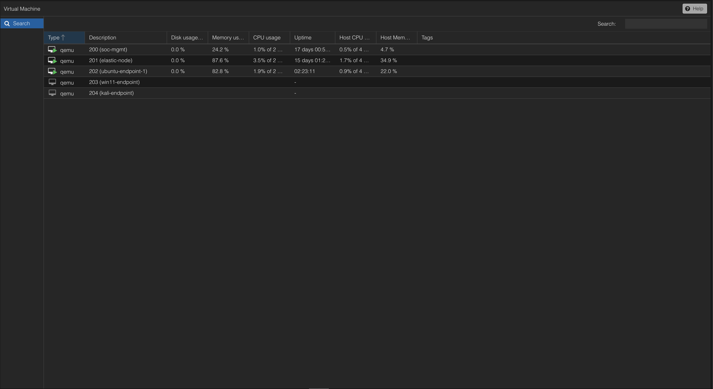
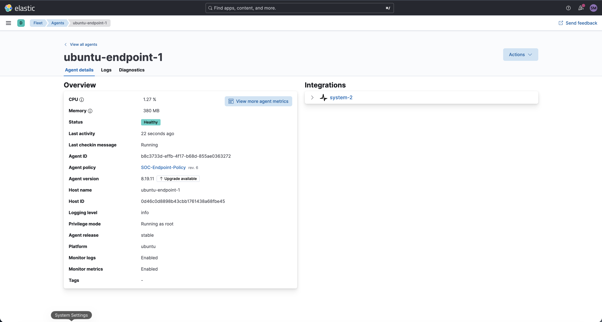
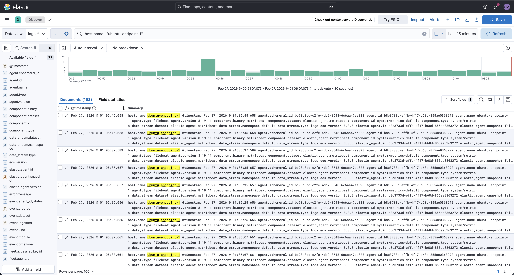

# OpenClaw x AI-Driven SOC Lab

A home SOC environment built on **Elastic SIEM** with an **AI agent layer (OpenClaw)** that supports alert triage, investigation support, case management, and executive reporting.

---
## 1️⃣ Situation

Traditional Security Operations Centers (SOCs) rely heavily on manual triage, repetitive alert investigation, and analyst fatigue.

I built this lab to simulate a modern AI-augmented SOC capable of structured detection, triage, enrichment, investigation, and executive reporting.

This environment runs inside my self-hosted Proxmox home lab.

### Infrastructure

- **Proxmox VE Host**
- **VM 200** – SOC Management Node (AI + orchestration layer)
- **VM 201** – Elastic SIEM Node
- **VM 202** – Ubuntu Endpoint (primary log source)
- **Elastic Stack (Fleet + Kibana)**
- **AI Agent Layer (OpenClaw Architecture)**

---
## 2️⃣ Task

Design and implement a structured, AI-assisted SOC workflow that includes:

- Centralized log ingestion from endpoint to Elastic
- Structured case lifecycle (Alert → Case → Investigation → Closure)
- AI-powered Tier 1 and Tier 2 analyst agents
- Executive-level daily summary automation
- Portfolio-ready documentation and evidence tracking

The objective is not just detection — but AI-assisted operational workflow and decision support.

---
## 3️⃣ Architecture Overview

### Log Flow

    Ubuntu Endpoint
        ↓
    Elastic Agent
        ↓
    Elastic Node
        ↓
    Kibana SIEM
        ↓
    AI Agent Layer (OpenClaw)
        ↓
    Case Management (GitHub Issues)
        ↓
    Executive Summary Output

This architecture separates responsibilities clearly:

- **Detection** → Elastic SIEM
- **Investigation Support** → AI Agent Layer
- **Case Tracking** → GitHub Issues
- **Executive Reporting** → SOC Manager Agent

---
## 4️⃣ AI Agent Roles (OpenClaw Model)

### 🔹 Tier 1 Agent

Responsibilities:

- Alert ingestion from Elastic
- Initial alert enrichment
- IOC extraction (IP, domain, hash, user activity)
- Basic severity classification
- Creation of structured case draft

Restrictions:

- Cannot close cases
- Cannot override severity without human review

---

### 🔹 Tier 2 Agent

Responsibilities:

- Deep log correlation across data sources
- Timeline reconstruction
- Behavioral pattern analysis
- Hypothesis generation
- Recommended remediation steps

Restrictions:

- Cannot finalize case closure
- Outputs recommendations only

---

### 🔹 SOC Manager Agent

Responsibilities:

- Reviews AI-generated findings
- Approves or rejects case closure
- Tracks open vs. closed cases
- Generates daily executive security summary
- Sends summary (WhatsApp integration planned)

> Human analyst remains the final decision authority.

---
## 5️⃣ Current Phase

- **Phase 1:** Infrastructure stabilization (Proxmox + VM setup)
- **Phase 2:** Elastic integration and endpoint log ingestion
- **Phase 3:** AI agent framework integration (OpenClaw)
- **Phase 4:** Executive reporting automation

This project is being built in phases to simulate real-world SOC deployment maturity.

---

## 6️⃣ Skills Demonstrated

- SIEM deployment and configuration (Elastic Stack)
- Endpoint log ingestion and telemetry flow design
- Virtualization and lab architecture (Proxmox)
- SOC workflow engineering (Alert → Case → Closure)
- AI-assisted security operations modeling
- Case lifecycle and documentation discipline
- Executive-level reporting design

---

## 7️⃣ Long-Term Vision

- Semi-autonomous Tier 1 triage assistance
- AI-driven cross-log correlation
- Automated investigation summaries
- Executive-level daily security posture reports
- Production-style SOC simulation for portfolio demonstration

This lab is designed not just as a learning project, but as a professional SOC architecture showcase.

---

## 🧾 Evidence — SOC Pipeline Validation

### 1️⃣ Infrastructure Running (Proxmox)

**Proves:**
- SOC-MGMT (VM 200) running
- Elastic Node (VM 201) running
- Ubuntu Endpoint (VM 202) running

---

### 2️⃣ Elastic Agent Healthy (Fleet)

**Proves:**
- Ubuntu endpoint successfully enrolled
- Agent policy applied
- Agent communicating with Elastic
- Logs & metrics enabled

---

### 3️⃣ Logs Ingested (Discover — logs-*)

**Proves:**
- Logs successfully indexed
- Data view operational
- Host-based filtering works
- Real-time ingestion confirmed

---

### 4️⃣ Security Telemetry (system.auth)

**Proves:**
- Authentication events captured
- Successful and session events visible
- SOC visibility into endpoint activity
- Security-relevant telemetry operational
