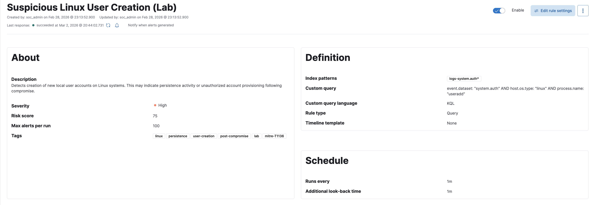
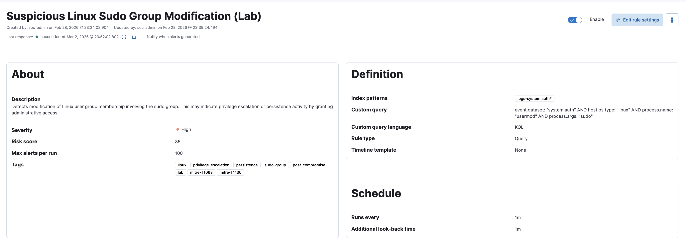
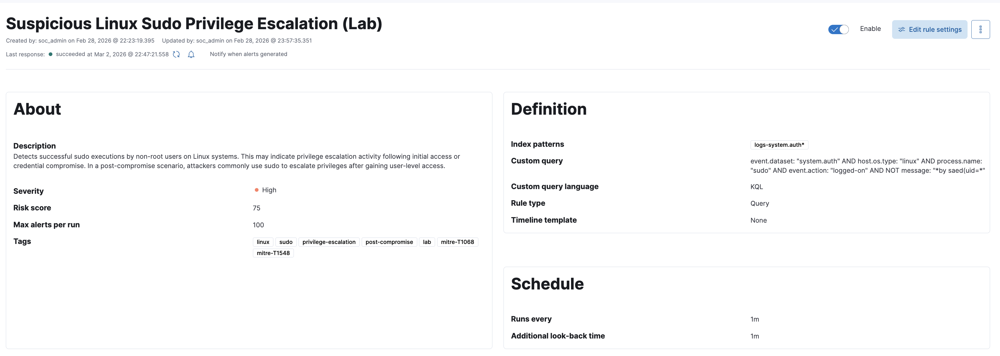
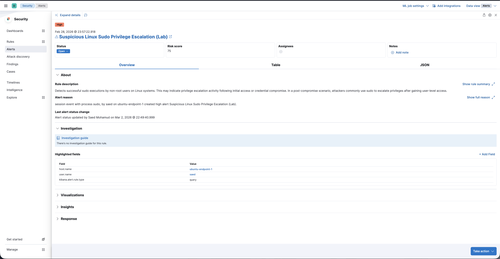
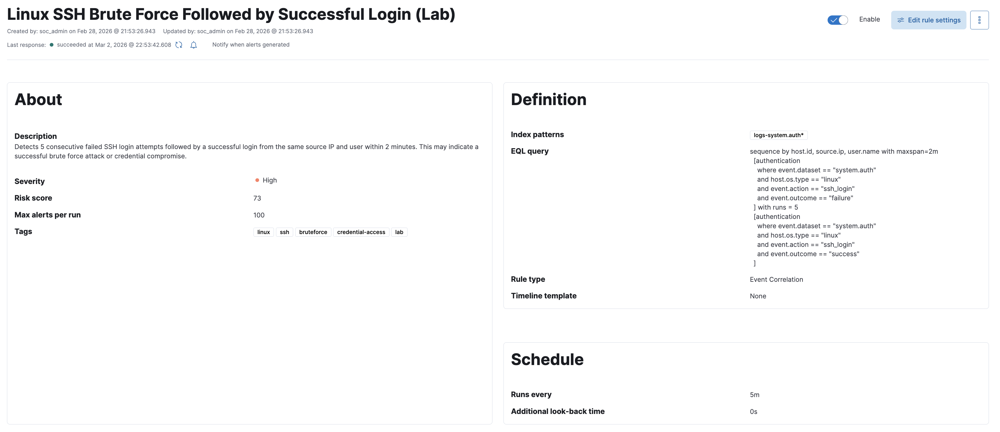
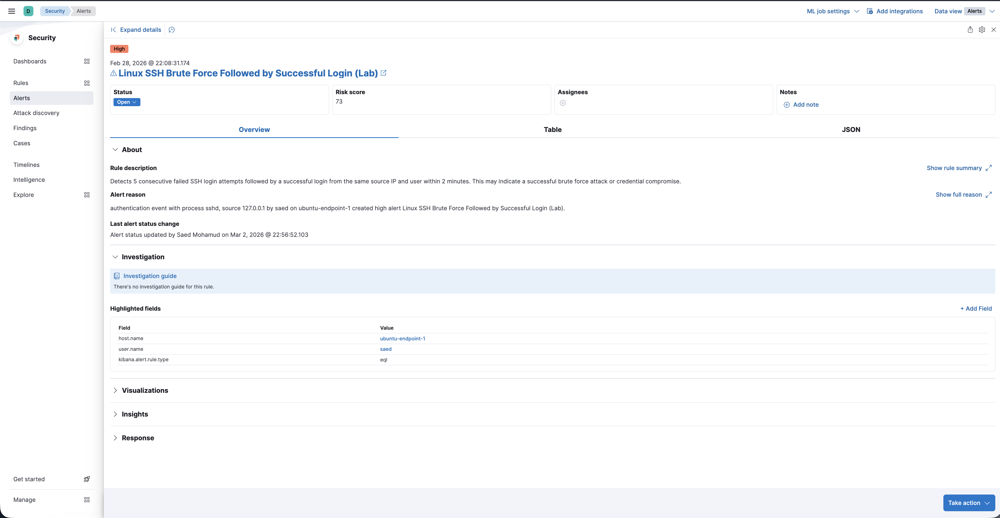

# OpenClaw x AI-Driven SOC Lab

A production-style home SOC built on **Elastic SIEM** with a structured roadmap toward AI-assisted security operations (OpenClaw).

This project simulates a modern Security Operations Center from infrastructure → telemetry → detection engineering → AI augmentation.

---

# 1️⃣ Project Overview

Traditional SOCs struggle with:

- Manual alert triage
- Analyst fatigue
- Repetitive investigations
- Slow executive reporting

This lab was built to engineer a structured, AI-augmented SOC workflow that evolves in maturity across defined phases.

The environment runs entirely inside my self-hosted Proxmox infrastructure.

---

# 2️⃣ Infrastructure Architecture (Phase 1)

## Virtualization Layer

- **Proxmox VE Host**
- **VM 200** – SOC Management Node (AI + orchestration layer)
- **VM 201** – Elastic SIEM Node
- **VM 202** – Ubuntu Endpoint (primary log source)

## Log Flow

Ubuntu Endpoint  
↓  
Elastic Agent  
↓  
Elastic Node  
↓  
Kibana SIEM  

This phase focused on building a stable telemetry foundation before introducing detection logic.

---

# 🧾 Phase 1 — SOC Pipeline Validation

### 1️⃣ Infrastructure Running (Proxmox)

**Validated:**
- All SOC VMs operational
- Resource allocation stable
- Isolated security lab environment

---

### 2️⃣ Elastic Agent Healthy (Fleet)

**Validated:**
- Ubuntu endpoint enrolled into Fleet
- Policy successfully applied
- Bi-directional communication confirmed

---

### 3️⃣ Log Ingestion Confirmed

**Validated:**
- logs-* index receiving data
- Real-time telemetry ingestion
- Host-based filtering operational

---

### 4️⃣ Security Telemetry Operational (system.auth)

**Validated:**
- Authentication events captured
- Session activity visible
- Security-relevant telemetry available for detection engineering

---

# 3️⃣ Detection Engineering (Phase 2)

With telemetry validated, Phase 2 focused on building custom detection logic rather than relying on default SIEM rules.

Each rule was:

- Designed from scratch (KQL / EQL)
- Tuned for lab environment
- Triggered via controlled adversary simulation
- Validated through alert generation
- Documented with configuration + alert evidence

---

## 🔹 Rule 01 — Suspicious Linux User Creation

Detects creation of new local user accounts.

**Security Objective:** Identify persistence mechanisms or unauthorized account provisioning.

**Evidence:**

Config  

Alert  

---

## 🔹 Rule 02 — Sudo Group Membership Modification

Detects modification of Linux sudo group membership.

**Security Objective:** Capture privilege escalation via administrative group assignment.

**Evidence:**

Config  

Alert  

---

## 🔹 Rule 03 — Suspicious Sudo Privilege Escalation

Detects successful sudo execution by non-root users.

**Security Objective:** Identify post-compromise privilege escalation behavior.

**Evidence:**

Config  

Alert  

---

## 🔹 Rule 04 — Internal SSH Brute Force

Detects 5 consecutive failed SSH login attempts within 30 seconds from same source.

**Security Objective:** Identify brute-force credential attacks.

**Evidence:**

Config  

Alert  

---

## 🔹 Rule 05 — SSH Brute Force Followed by Successful Login

Detects multiple failed attempts followed by a successful login within 2 minutes.

**Security Objective:** Identify potential credential compromise.

**Evidence:**

Config  

Alert  

---

# 4️⃣ SOC Workflow Model (Planned Phase 3+)

The long-term architecture introduces an AI agent layer (OpenClaw):

- Tier 1 Agent → Alert enrichment + case drafting
- Tier 2 Agent → Deep investigation + timeline reconstruction
- SOC Manager Agent → Executive summary generation

Detection (Elastic) → Investigation (AI) → Case (GitHub) → Executive Report

Human analyst remains final decision authority.

---

# 5️⃣ Skills Demonstrated (Through Phase 2)

- Elastic SIEM deployment and tuning
- Endpoint telemetry engineering
- KQL & EQL rule development
- Event correlation logic
- Adversary behavior simulation
- Alert validation & tuning
- SOC documentation discipline
- Structured phased project execution

---

# 6️⃣ Project Maturity Roadmap

- ✅ Phase 1 – Infrastructure + Telemetry
- ✅ Phase 2 – Custom Detection Engineering
- 🔄 Phase 3 – AI Triage Layer Integration
- 🔄 Phase 4 – Executive Reporting Automation

This project is being built intentionally in phases to mirror real-world SOC capability evolution.

---

# Long-Term Vision

A semi-autonomous AI-assisted SOC capable of:

- Tier 1 triage automation
- Cross-log behavioral correlation
- Investigation summary generation
- Executive-level daily reporting
- Production-style SOC simulation

This lab is not just a learning environment — it is a portfolio-grade SOC architecture showcase.
